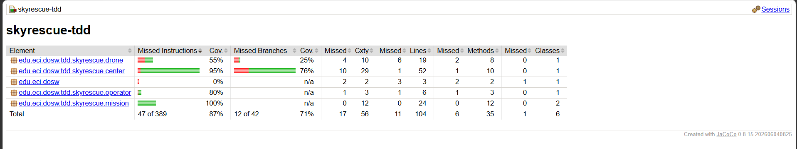

# DOSW - Laboratorio 5: TDD y Cobertura de Pruebas (SkyRescue)

**Integrantes:**
- Samuel Argalle
- Pedro Ayala
- Javier Caicedo

---

## Descripción de SkyRescue

SkyRescue su principal meta busca solucionar el poder ordenar drones, operadores y las misiones de rescate de una manera eficiente sin dejar que drones asignados o operadores asignados a una mission se puedan asignar a otra misión

las principales reglas de negocio son

* si un dron asignado a un rescue center esta en una mision no debe asignado a otra mision
* un operador tampoco puede estar asignado a dos misiones
* la distancia de la misión no debe exeder la maxima distancia del drone
* si una misión ya fue completada no debe volver a cambiar su estado

las tres operaciones desarrolladas con TDD fueron:
* addDrone() : registra un dron a un rescue center con su respectivo id y verifica que dos drones no tengan un mismo id, y los registra como disponible, devuelve un booleano de la operacion
* assignMission() : asigna una mision a un operador y a un dron disponible verificando que tanto el operador como el dron existan y esten disponibles, devuelve una misión con un estado activo
* completeMission(): cambia el estado de una mision a completada si se encunetra registrada y no fue completada ya 

## Evidencia TDD

metodo addDrone()

**RED:** prueba que demuestra que no se pude asignar un dron a un rescue center 

**Green:** implementacion minima que hace pasar la prueba

**Refacotr:** al inicio todas las condiciones de un condicional estaban colocadas en una sola lineal, entonces se cambió a varios if de manera separada, lo cual hace que sea más fácil testear en TDD, cada if corresponde a un test unitario claro.

metodo assignMission()

**RED:**  prueba que demuestra que no se pude asignar misiones a un dron inexistente

**Green:** implementacion minima que hace pasar la prueba

**Refactor:**Basicamente uso de streams para una busqueda más limpia y la separación de los if de las excepciones

metodo completeMission_()

**Red:** prueba que no se puede completar una mision que ya estaba completada

**Green:** implementacion minima que hace pasar la prueba

**Refactrr:** evitamos que en una parte se hable con extraños

## Evidencia de cobertura

> **Nota:** Debido a que desde la primera ejecución se obtuvo un **89.4% de cobertura de líneas** (superando el 85% mínimo requerido por JaCoCo en el `pom.xml`), no fue necesario modificar el diseño inicial de pruebas ni la tabla de cobertura, utilizándose el mismo resultado para ambos casos (inicial y final).

### Primera ejecución

### Cobertura final

## SonarQube

## Pull Requests

- PR estrucutra laboratorio : [Google](https://github.com/pedroay/DOSW_LAB5_AYALA_ARGALLE_CAICEDO/pull/1)
- PR clases base: [Google](https://github.com/pedroay/DOSW_LAB5_AYALA_ARGALLE_CAICEDO/pull/2)
- PR TDD addDrone: [Google](https://github.com/pedroay/DOSW_LAB5_AYALA_ARGALLE_CAICEDO/pull/3)
- PR TDD assignMission: [Google](https://github.com/pedroay/DOSW_LAB5_AYALA_ARGALLE_CAICEDO/pull/4)
- PR TDD completeMission: [Google](https://github.com/pedroay/DOSW_LAB5_AYALA_ARGALLE_CAICEDO/pull/5)
- PR JaCoCo: [Google](https://github.com/pedroay/DOSW_LAB5_AYALA_ARGALLE_CAICEDO/pull/6)
- PR SonarQube: [Google](https://github.com/pedroay/DOSW_LAB5_AYALA_ARGALLE_CAICEDO/pull/7)

## Reflexion tecnica

¿Qué error o comportamiento inesperado fue detectado primero gracias a una prueba?
¿Qué parte del código cambió durante REFACTOR sin modificar el comportamiento?
¿Qué casos adicionales aparecieron al revisar la cobertura?
¿Qué hallazgo de SonarQube produjo un cambio real en el código?